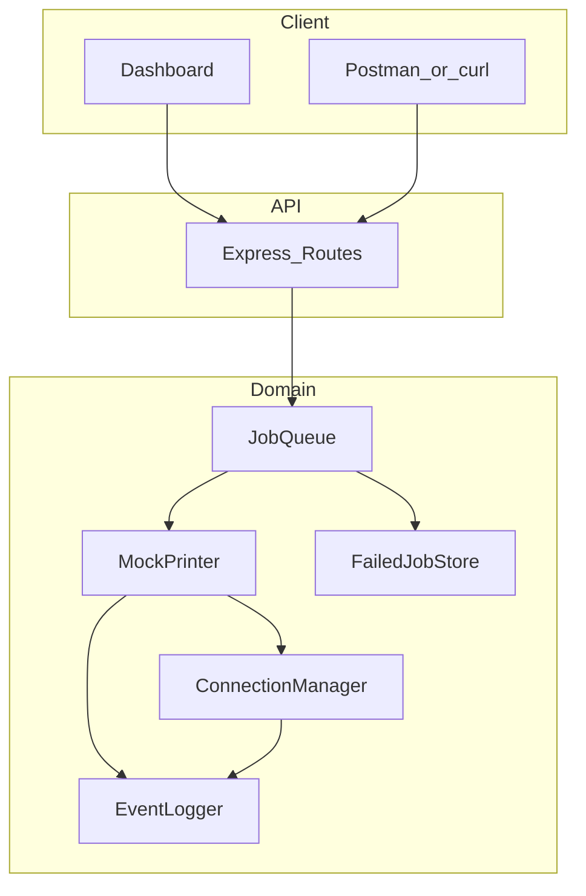
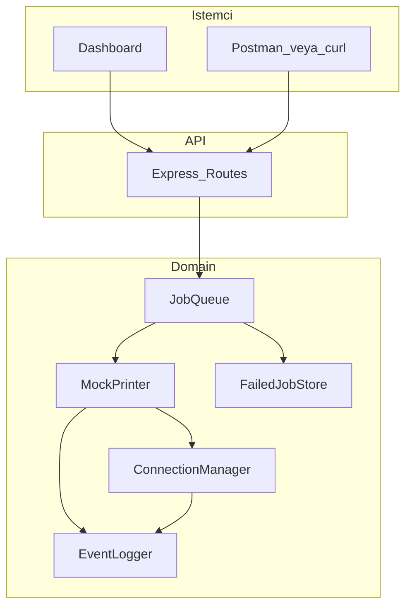

# ACO Thermal Printer Service / Termal Yazıcı Servisi

**Languages:** [English](#english) · [Türkçe](#türkçe)

---

<a id="english"></a>

# English

Mock thermal printer service for the ACO Recycling technical assignment. Simulates USB/LAN connection, print queue, hardware errors, structured logging, and a localhost control panel.

## Features

### Core
- USB and LAN (`lan`) connection modes with automatic reconnect and exponential backoff
- REST API: `/connect`, `/print/text`, `/print/image`, `/status`, `/logs`, `/reprint`
- Hardware error simulation: `PAPER_OUT`, `PAPER_JAM`, `COVER_OPEN`, `OVERHEAT`, `COMM_ERROR`, `UNKNOWN_COMMAND`
- JSON logging with the required schema (`ts`, `op`, `conn`, `jobId`, `status`, `error`)
- Failed image job persistence and reprint support
- Turkish and English receipt/text printing (structured receipt + plain text)

### Bonus
- Dashboard UI at `http://localhost:3000`
- Job queue with idempotency by `jobId`
- `GET /health`
- CSV log export: `GET /logs?format=csv`
- Optional API token auth
- Docker support
- ETA estimate and paper roll percentage in `/status`

## Architecture



## Requirements

- Node.js 20+
- npm

## Setup

```bash
npm install
cp .env.example .env
node scripts/create-voucher.js
```

## Run

```bash
npm start
```

Open the dashboard: [http://localhost:3000](http://localhost:3000)

Development with auto-reload:

```bash
npm run dev
```

## Docker (Bonus)

Docker is optional but included for one-command deployment. The image builds the app with Node 20 Alpine and exposes port `3000`.

### Prerequisites

- [Docker Desktop](https://www.docker.com/products/docker-desktop/) installed and running

### Run with Docker

**Important:** Stop any local `npm start` instance first. Docker and `npm start` both bind to port `3000` — only one can run at a time.

```bash
docker-compose up --build
```

Open the dashboard: [http://localhost:3000](http://localhost:3000)

Run in background:

```bash
docker-compose up --build -d
```

Stop the container:

```bash
docker-compose down
```

### Verify Docker is working

```bash
curl http://localhost:3000/health
```

Expected response:

```json
{ "status": "ok", "uptime": 1, "queueSize": 0 }
```

### Port already in use

If you see an error like:

```text
ports are not available: exposing port TCP 0.0.0.0:3000 ... bind: address already in use
```

Port `3000` is already taken — usually because `npm start` is still running.

**Option A — stop local server (recommended):**

```powershell
# Stop npm start in its terminal (Ctrl+C), then:
docker-compose up --build
```

**Option B — use a different host port:**

Edit `docker-compose.yml`:

```yaml
ports:
  - "3001:3000"
```

Then open [http://localhost:3001](http://localhost:3001).

### Docker vs npm start

| | `npm start` | `docker-compose up` |
|---|-------------|---------------------|
| Requires Node.js locally | Yes | No |
| Port | 3000 | 3000 (host) |
| Failed job data | `./data/failed-jobs/` | Same (volume mounted) |
| Use case | Development | Demo / reviewer quick start |

Configuration is loaded from [`.env.example`](.env.example) inside the container. For custom settings, copy it to `.env` and update `docker-compose.yml` to use `env_file: .env`.

Manual test steps: see [`TEST_SCENARIOS.md`](TEST_SCENARIOS.md).

## API

| Method | Path | Description |
|--------|------|-------------|
| POST | `/connect` | Connect printer `{ "mode": "usb" \| "lan" }` |
| POST | `/print/text` | Print text or structured receipt |
| POST | `/print/image` | Print base64 image |
| GET | `/status` | Connection, hardware, queue, failed jobs |
| GET | `/logs` | JSON logs (`?format=csv` for CSV) |
| POST | `/reprint` | Reprint failed job `{ "jobId": "..." }` |
| GET | `/health` | Service health (bonus) |
| POST | `/simulate/error` | Force hardware error (demo) |
| POST | `/simulate/clear` | Clear simulated error |

### Examples

Connect USB:

```bash
curl -X POST http://localhost:3000/connect \
  -H "Content-Type: application/json" \
  -d "{\"mode\":\"usb\"}"
```

Print text (Turkish):

```bash
curl -X POST http://localhost:3000/print/text \
  -H "Content-Type: application/json" \
  -d "{\"jobId\":\"t1\",\"text\":\"Test fiş\",\"lang\":\"tr\"}"
```

Print structured receipt:

```bash
curl -X POST http://localhost:3000/print/text \
  -H "Content-Type: application/json" \
  -d @samples/receipt-payload.json
```

Print voucher image:

```bash
curl -X POST http://localhost:3000/print/image \
  -H "Content-Type: application/json" \
  -d "{\"jobId\":\"voucher-demo\",\"imageBase64\":\"...\"}"
```

Status:

```bash
curl http://localhost:3000/status
```

Reprint failed job:

```bash
curl -X POST http://localhost:3000/reprint \
  -H "Content-Type: application/json" \
  -d "{\"jobId\":\"voucher-demo\"}"
```

## Idempotency

If the same `jobId` is submitted twice, the second request returns the existing job without enqueueing a duplicate print.

## Environment Variables

See [`.env.example`](.env.example).

| Variable | Default | Purpose |
|----------|---------|---------|
| `PORT` | 3000 | HTTP port |
| `API_TOKEN` | empty | Optional bearer token |
| `CONNECT_DELAY_MS` | 800 | Simulated connect delay |
| `PRINT_DELAY_MS` | 1200 | Simulated print delay |
| `ERROR_PROBABILITY` | 0.12 | Random hardware error chance |
| `DISCONNECT_PROBABILITY` | 0.03 | Random disconnect chance |
| `BACKOFF_BASE_MS` | 1000 | Reconnect backoff base |
| `BACKOFF_MAX_MS` | 30000 | Reconnect backoff cap |

## Testing

Automated tests:

```bash
npm test
```

Manual test scenarios (step-by-step): [`TEST_SCENARIOS.md`](TEST_SCENARIOS.md)

## Delivery Checklist

- Source code
- [`README.md`](README.md)
- [`examples/logs.json`](examples/logs.json)
- [`samples/voucher.png`](samples/voucher.png)
- UI screenshots (capture from dashboard)
- [`Dockerfile`](Dockerfile) and [`docker-compose.yml`](docker-compose.yml)
- [`.env.example`](.env.example)

## Design Notes

- In-memory queue is sufficient for this mock service; production could use Redis/BullMQ.
- No physical printer SDK is required; all hardware behavior is simulated.
- Print jobs wait in queue when disconnected and resume after reconnect.
- Failed image jobs are stored under `data/failed-jobs/` for reprint and UI preview.
- Dismissing the error banner (×) only hides the UI message; use **Clear Error** before reprint when a simulated error is active.

---

<a id="türkçe"></a>

# Türkçe

ACO Recycling teknik ödevi için termal yazıcı mock servisi. USB/LAN bağlantısı, baskı kuyruğu, donanım hataları, yapılandırılmış loglama ve localhost kontrol paneli simüle eder.

## Özellikler

### Zorunlu (Core)
- USB ve LAN (`lan`) bağlantı modları, otomatik yeniden bağlanma ve exponential backoff
- REST API: `/connect`, `/print/text`, `/print/image`, `/status`, `/logs`, `/reprint`
- Donanım hata simülasyonu: `PAPER_OUT`, `PAPER_JAM`, `COVER_OPEN`, `OVERHEAT`, `COMM_ERROR`, `UNKNOWN_COMMAND`
- Zorunlu JSON log şeması (`ts`, `op`, `conn`, `jobId`, `status`, `error`)
- Başarısız görsel iş saklama ve tekrar baskı (reprint) desteği
- Türkçe ve İngilizce fiş/metin baskısı (yapılandırılmış fiş + düz metin)

### Bonus
- `http://localhost:3000` adresinde dashboard UI
- `jobId` ile idempotency destekli iş kuyruğu
- `GET /health`
- CSV log dışa aktarma: `GET /logs?format=csv`
- Opsiyonel API token kimlik doğrulama
- Docker desteği
- `/status` içinde ETA tahmini ve kağıt rulo yüzdesi

## Mimari



## Gereksinimler

- Node.js 20+
- npm

## Kurulum

```bash
npm install
cp .env.example .env
node scripts/create-voucher.js
```

Windows:

```powershell
copy .env.example .env
```

## Çalıştırma

```bash
npm start
```

Dashboard: [http://localhost:3000](http://localhost:3000)

Geliştirme modu (otomatik yeniden yükleme):

```bash
npm run dev
```

## Docker (Bonus)

Docker zorunlu değildir; tek komutla ayağa kaldırma için eklenmiştir. Image Node 20 Alpine ile oluşturulur ve `3000` portunu açar.

### Gereksinimler

- [Docker Desktop](https://www.docker.com/products/docker-desktop/) kurulu ve çalışır durumda olmalı

### Docker ile çalıştırma

**Önemli:** Önce local `npm start` örneğini durdurun. Docker ve `npm start` ikisi de `3000` portunu kullanır — aynı anda yalnızca biri çalışabilir.

```bash
docker-compose up --build
```

Dashboard: [http://localhost:3000](http://localhost:3000)

Arka planda çalıştırma:

```bash
docker-compose up --build -d
```

Container'ı durdurma:

```bash
docker-compose down
```

### Docker'ın çalıştığını doğrulama

```bash
curl http://localhost:3000/health
```

Beklenen yanıt:

```json
{ "status": "ok", "uptime": 1, "queueSize": 0 }
```

### Port zaten kullanımda

Şu hatayı alırsanız:

```text
ports are not available: exposing port TCP 0.0.0.0:3000 ... bind: address already in use
```

`3000` portu doludur — genelde `npm start` hâlâ çalışıyordur.

**Seçenek A — local sunucuyu durdur (önerilen):**

```powershell
# npm start terminalinde Ctrl+C, sonra:
docker-compose up --build
```

**Seçenek B — farklı port kullan:**

`docker-compose.yml` dosyasını düzenle:

```yaml
ports:
  - "3001:3000"
```

Sonra [http://localhost:3001](http://localhost:3001) adresini aç.

### Docker vs npm start

| | `npm start` | `docker-compose up` |
|---|-------------|---------------------|
| Local Node.js gerekir mi | Evet | Hayır |
| Port | 3000 | 3000 (host) |
| Başarısız iş verisi | `./data/failed-jobs/` | Aynı (volume mount) |
| Kullanım | Geliştirme | Demo / hızlı inceleme |

Container içinde yapılandırma [`.env.example`](.env.example) dosyasından okunur. Özel ayar için `.env` oluşturup `docker-compose.yml` içinde `env_file: .env` kullanın.

Manuel test adımları: [`TEST_SCENARIOS.md`](TEST_SCENARIOS.md)

## API

| Method | Path | Açıklama |
|--------|------|----------|
| POST | `/connect` | Yazıcıyı bağla `{ "mode": "usb" \| "lan" }` |
| POST | `/print/text` | Metin veya yapılandırılmış fiş bas |
| POST | `/print/image` | Base64 görsel bas |
| GET | `/status` | Bağlantı, donanım, kuyruk, başarısız işler |
| GET | `/logs` | JSON loglar (`?format=csv` ile CSV) |
| POST | `/reprint` | Başarısız işi tekrar bas `{ "jobId": "..." }` |
| GET | `/health` | Servis sağlığı (bonus) |
| POST | `/simulate/error` | Donanım hatası simüle et (demo) |
| POST | `/simulate/clear` | Simüle hatayı temizle |

### Örnekler

USB bağlantı:

```bash
curl -X POST http://localhost:3000/connect \
  -H "Content-Type: application/json" \
  -d "{\"mode\":\"usb\"}"
```

Metin baskısı (Türkçe):

```bash
curl -X POST http://localhost:3000/print/text \
  -H "Content-Type: application/json" \
  -d "{\"jobId\":\"t1\",\"text\":\"Test fiş\",\"lang\":\"tr\"}"
```

Yapılandırılmış fiş:

```bash
curl -X POST http://localhost:3000/print/text \
  -H "Content-Type: application/json" \
  -d @samples/receipt-payload.json
```

Voucher görsel baskısı:

```bash
curl -X POST http://localhost:3000/print/image \
  -H "Content-Type: application/json" \
  -d "{\"jobId\":\"voucher-demo\",\"imageBase64\":\"...\"}"
```

Durum sorgulama:

```bash
curl http://localhost:3000/status
```

Başarısız işi tekrar bas:

```bash
curl -X POST http://localhost:3000/reprint \
  -H "Content-Type: application/json" \
  -d "{\"jobId\":\"voucher-demo\"}"
```

PowerShell alternatifi:

```powershell
Invoke-RestMethod -Method Post -Uri http://localhost:3000/connect -ContentType application/json -Body '{"mode":"usb"}'
```

## Idempotency (Tekrar Güvenliği)

Aynı `jobId` ile ikinci istek gelirse, sistem mevcut işi döndürür ve mükerrer baskı yapmaz.

## Ortam Değişkenleri

Bkz. [`.env.example`](.env.example)

| Değişken | Varsayılan | Açıklama |
|----------|------------|----------|
| `PORT` | 3000 | HTTP portu |
| `API_TOKEN` | boş | Opsiyonel bearer token |
| `CONNECT_DELAY_MS` | 800 | Simüle bağlantı gecikmesi |
| `PRINT_DELAY_MS` | 1200 | Simüle baskı gecikmesi |
| `ERROR_PROBABILITY` | 0.12 | Rastgele donanım hatası olasılığı |
| `DISCONNECT_PROBABILITY` | 0.03 | Rastgele kopma olasılığı |
| `BACKOFF_BASE_MS` | 1000 | Yeniden bağlanma backoff tabanı |
| `BACKOFF_MAX_MS` | 30000 | Yeniden bağlanma backoff üst sınırı |

## Test

Otomatik testler:

```bash
npm test
```

Manuel test senaryoları (adım adım): [`TEST_SCENARIOS.md`](TEST_SCENARIOS.md)

## Teslim Kontrol Listesi

- Kaynak kod
- [`README.md`](README.md)
- [`examples/logs.json`](examples/logs.json)
- [`samples/voucher.png`](samples/voucher.png)
- UI ekran görüntüleri (dashboard'dan)
- [`Dockerfile`](Dockerfile) ve [`docker-compose.yml`](docker-compose.yml)
- [`.env.example`](.env.example)

## Tasarım Notları

- Bu mock servis için in-memory kuyruk yeterlidir; production ortamında Redis/BullMQ kullanılabilir.
- Fiziksel yazıcı SDK'sı gerekmez; tüm donanım davranışı simüle edilir.
- Bağlantı koptuğunda işler kuyrukta bekler, yeniden bağlanınca devam eder.
- Başarısız görsel işler `data/failed-jobs/` altında saklanır; reprint ve UI önizlemesi için kullanılır.
- Hata banner'ını kapatmak (×) yalnızca mesajı gizler; simüle hata aktifken reprint öncesi **Clear Error** kullanın.

---

**Languages:** [English](#english) · [Türkçe](#türkçe)
